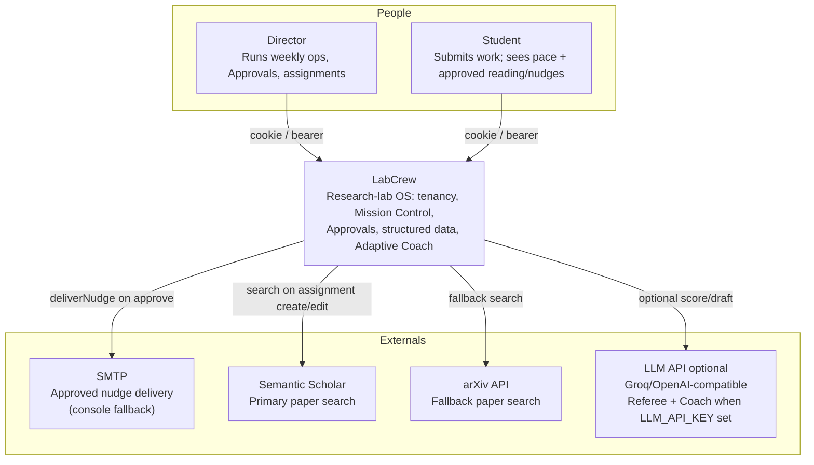
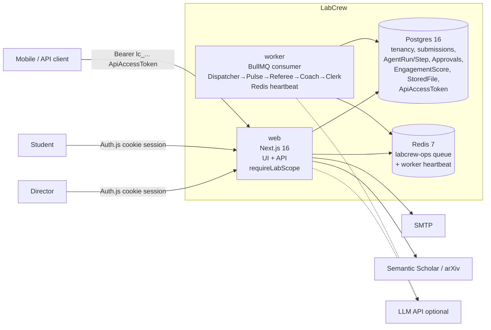
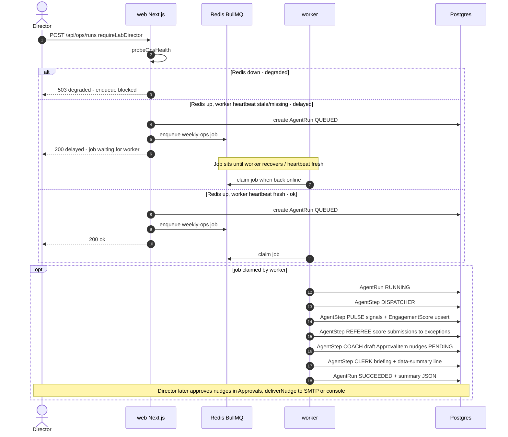
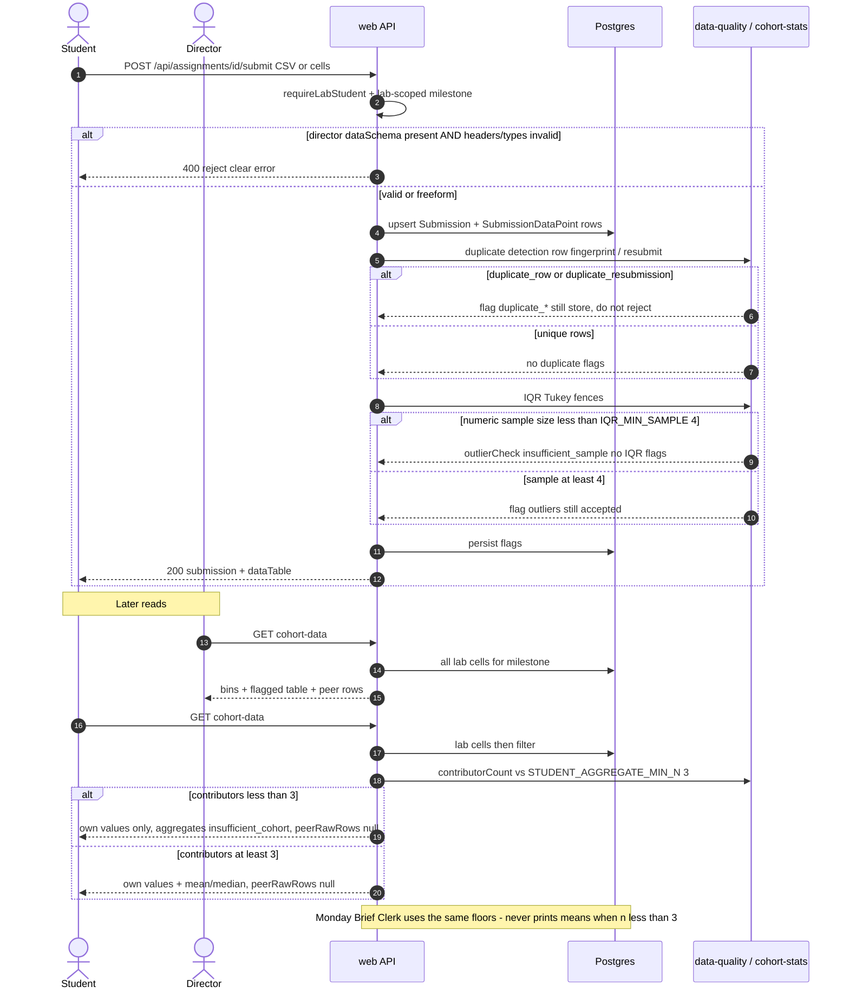

# LabCrew system design (Phase 6)

Short map of how the running system fits together. Deep dives live in linked docs -- this file is the index.

## 1. Processes

| Process | Role | Entry |
| ------- | ---- | ----- |
| **web** | Next.js App Router -- marketing, `/app`, API routes | `npm run dev` / Compose `web` |
| **worker** | BullMQ consumer -- weekly ops agents + Redis heartbeat | `npm run worker` / Compose `worker` |
| **postgres** | Source of truth (incl. file blobs) | Compose `postgres` |
| **redis** | Ops queue + worker heartbeat | Compose `redis` |

Day-2 ops: [ADMIN.md](../ADMIN.md).

### C4 context (L1)

Actors and external systems LabCrew talks to in the **shipped** product (Adaptive Coach Phase C retrieval + nudge SMTP included).



### C4 container (L2)

Matches the process table above. Auth: **web sessions (Auth.js cookies)** and **mobile/API bearers (`ApiAccessToken` / `lc_...`)** both enter through `web` → `requireLabScope`.



## 2. Auth & API surface

- **Web:** Auth.js session cookies (`src/auth.ts`, `src/auth.config.ts`).
- **Mobile / API:** Bearer tokens `lc_...` (`src/server/auth/api-tokens.ts`) -- lab-scoped, expiring, revocable.
- API routes resolve a lab via `requireLabScope` / `requireLabDirector` / `requireLabStudent` (`src/server/tenancy/lab-scope.ts`).

## 3. Tenancy

**Tenant key:** `organizationId`, aliased as **`labId`** in application code.

**Enforcement:** repository / helper layer only (`find*InLab`, `inLab`). **No Prisma middleware** for tenant injection.

**CI gate:** `npm run test:isolation` -- Lab A cannot read Lab B (including bearer path, structured data, peer raw rows, and Phase D student coach reads). Required on `master`.

Deep dive: [TENANCY.md](./TENANCY.md).

## 4. Weekly ops pipeline

```text
POST /api/ops/runs  ->  BullMQ  ->  worker
                                   |
         Dispatcher -> Pulse -> Referee -> Coach -> Clerk
                                   |
                                Postgres (AgentRun / AgentStep / ApprovalItem)
```

- Queue: `src/server/queue/ops-queue.ts`
- Worker: `src/server/workers/ops-worker.ts`
- Agents: `src/server/agents/weekly-ops.ts` (Pulse also upserts `EngagementScore`; Coach personalizes from trends)
- Detail: [WORKERS.md](./WORKERS.md)

### Sequence — weekly ops



## 5. Ops health / degraded modes

`GET /api/ops/health` (`src/server/ops/health.ts`):

| Redis | Worker heartbeat | Mode |
| ----- | ---------------- | ---- |
| down | -- | **degraded** -- dispatch blocked |
| up | stale / missing | **delayed** -- enqueue OK; processing waits |
| up | fresh (< 90s) | **ok** |

Mission Control surfaces these banners; approvals load failure is not an empty inbox.

## 6. Structured data pipeline (Collect -> Analyze)

Canonical ADR: [adr/001-structured-data-submissions.md](./adr/001-structured-data-submissions.md).

| Phase | What | Key paths |
| ----- | ---- | --------- |
| **A Collect** | `SubmissionDataPoint` cells; optional `Milestone.dataSchema`; rubric `acceptData` | `prisma/schema.prisma`, `src/server/data/submission-data.ts`, `POST .../assignments/[id]/submit` |
| **B Clean** | Schema validation (director schema only); duplicate flags; IQR outliers (**flag, do not reject**); `IQR_MIN_SAMPLE = 4` | `src/server/data/data-quality.ts`, `scripts/verify-phase-b.ts` |
| **C Visualize** | Director histograms + flagged table; student own vs aggregates; `STUDENT_AGGREGATE_MIN_N = 3` (privacy floor, independent of IQR) | `GET .../cohort-data`, `src/server/data/cohort-stats.ts`, `scripts/verify-phase-c.ts` |
| **D Analyze** | Clerk appends data-summary line to Monday Brief (means, flagged counts; **no peer raw rows**) | `src/server/data/brief-data-summary.ts`, Clerk step in `weekly-ops.ts`, `scripts/verify-phase-d.ts` |

**Privacy rules:**

- Students: never return classmates' raw cells; hide cohort mean/median when contributor count < 3.
- **Monday Brief / exports** use the **same** floors (hotfix after Phase D): below 3 contributors the line is `aggregates hidden -- insufficient data (N of 3 min contributors)` and does **not** print means. Lock: `npm run verify:brief-privacy`.

**Verify scripts:** `npm run verify:phase-b` | `verify:phase-c` | `verify:phase-d` | `verify:brief-privacy`.

### Sequence — structured data submit → visualize (privacy branches)



## 7. Data store

- Prisma 7 + Postgres adapter (`src/lib/db.ts`, `prisma/schema.prisma`).
- Local setup: [DATA.md](./DATA.md).
- Files stored as `StoredFile` blobs in Postgres (no S3 required for v1).

## 8. UI system

Product look-and-feel (not architecture): [DESIGN.md](./DESIGN.md). Adaptive Coach student tone: same file § Adaptive Coach tone.

## 9. Doc map

| Doc | Role |
| --- | ---- |
| [PHASES.md](./PHASES.md) | Build / upgrade track |
| [TENANCY.md](./TENANCY.md) | Lab isolation rules |
| [DATA.md](./DATA.md) | Prisma / local DB |
| [WORKERS.md](./WORKERS.md) | BullMQ worker |
| [DESIGN.md](./DESIGN.md) | Visual design system |
| [adr/001-...](./adr/001-structured-data-submissions.md) | Structured data decisions |
| [adr/002-...](./adr/002-adaptive-coach.md) | Adaptive Coach (engagement + resources) |
| [ADMIN.md](../ADMIN.md) | Install + ops bible |
| **This file** | System design index + C4 / sequence diagrams |

## Status

**Finalized (Phase 6)** -- index/table shape plus Mermaid C4 context, C4 container, weekly-ops sequence, and structured-data privacy sequence. Diagrams match the shipped tree (post Adaptive Coach A–D on `master`).

Keep the §6 Brief-privacy hotfix note honest (caught after structured-data Phase D); do not scrub it for tidiness.
